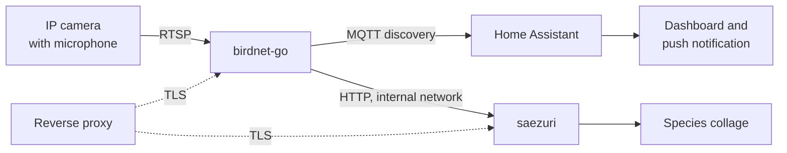

# Birding with AI

Turn an IP camera you already own into a bird recorder. [BirdNET-Go](https://github.com/tphakala/birdnet-go)
reads the camera's audio over RTSP, identifies species, and publishes every detection to Home Assistant
over MQTT. [Saezuri](https://github.com/vrwrts/saezuri) renders the same detections as an illustrated
collage.

This repository holds a vendor-neutral runbook and the configuration snippets behind it. It comes from one
working installation and states which parts are verified and which are choices you may want to revisit.



## What you get

- Species detections from a camera microphone, no extra hardware.
- Four Home Assistant sensors that survive restarts: last species, species total, species today,
  detections today.
- A push notification on every species new to the garden.
- A Home Assistant dashboard with counters, an hourly chart, species lists, and the collage in a panel view.
- An illustrated collage that pulls artwork from a free library and generates the rest on demand.

## Requirements

| Component | Requirement |
|---|---|
| Camera | RTSP stream carrying audio; a wide-band track (48 kHz Opus) beats a narrow-band one (16 kHz AAC) |
| Host | Docker with Compose v2; roughly one third of a modern x86 core per audio stream |
| Home Assistant | Optional; needs an MQTT broker and the MQTT integration |
| Reverse proxy | Optional; the runbook uses Caddy with an internal CA |
| Gemini API key | Optional; only for generating artwork Saezuri cannot download |

## Quick start

```bash
git clone https://github.com/mrebbert/Birding-with-AI.git
cd Birding-with-AI
cp snippets/.env.example .env
$EDITOR .env                              # camera, hostnames, coordinates
./snippets/scripts/check-rtsp-stream.sh   # does the stream carry audio?
./snippets/scripts/apply-placeholders.sh  # writes build/ with your values
```

`build/` then holds the Compose file, the Caddyfile, and the Home Assistant YAML ready to copy to their
places.

Then follow [RUNBOOK.md](RUNBOOK.md) from step 0. It takes about 60 minutes including verification.

## Repository layout

| Path | Contents |
|---|---|
| [RUNBOOK.md](RUNBOOK.md) | The installation, step 0 to step 8, each step with a checkpoint |
| [docs/architecture.md](docs/architecture.md) | The decisions behind the setup and what each one costs |
| [docs/tuning.md](docs/tuning.md) | Raising detection quality and removing false positives |
| [docs/operations.md](docs/operations.md) | Updates, backup, scaling, rollback |
| [docs/troubleshooting.md](docs/troubleshooting.md) | Every trap this installation hit, with the fix |
| [snippets/](snippets/) | Compose file, Caddyfile, Home Assistant YAML, helper scripts |

## Placeholders

Every snippet uses the same placeholder names. Replace them once and the files fit together.

| Placeholder | Meaning | Example |
|---|---|---|
| `CAMERA_HOST` | Address serving the RTSP stream, often the NVR rather than the camera | `192.168.1.10` |
| `RTSP_TOKEN` | Stream token, one per quality level | `Ab3xY9qZ` |
| `BIRDNET_HOSTNAME` | Public name of the BirdNET-Go interface | `birdnet.example.lan` |
| `SAEZURI_HOSTNAME` | Public name of the collage | `birds.example.lan` |
| `MQTT_HOST` | MQTT broker | `mqtt.example.lan` |
| `MQTT_USER`, `MQTT_PASSWORD` | Broker credentials | `birdnet` |
| `LATITUDE`, `LONGITUDE` | Site coordinates; they drive the range filter | `52.52`, `13.40` |
| `SOURCE_SLUG` | How BirdNET-Go names the audio source inside entity IDs | `backyard` |
| `NOTIFY_SERVICE` | Home Assistant notify service | `notify.mobile_app_pixel` |

`snippets/scripts/apply-placeholders.sh` substitutes all of them from your `.env` into a copy of the
snippets, so the originals stay reusable.

## Privacy and law

Camera microphones pick up conversations, including those of people passing by. This setup keeps that in
mind:

- Audio export stays off, so clips are discarded and only detections persist.
- The BirdNET-Go privacy filter stays on; it drops segments containing human speech.
- German law (§ 201 StGB) protects the spoken word of non-public conversation. Check the equivalent rule
  where you live before you point a microphone at the street.

## Credits

- [tphakala/birdnet-go](https://github.com/tphakala/birdnet-go) for the detector and its web interface.
- [vrwrts/saezuri](https://github.com/vrwrts/saezuri) for the collage and the illustration library.
- [BirdNET](https://birdnet.cornell.edu/) by the K. Lisa Yang Center for Conservation Bioacoustics.

## License

MIT, see [LICENSE](LICENSE).
