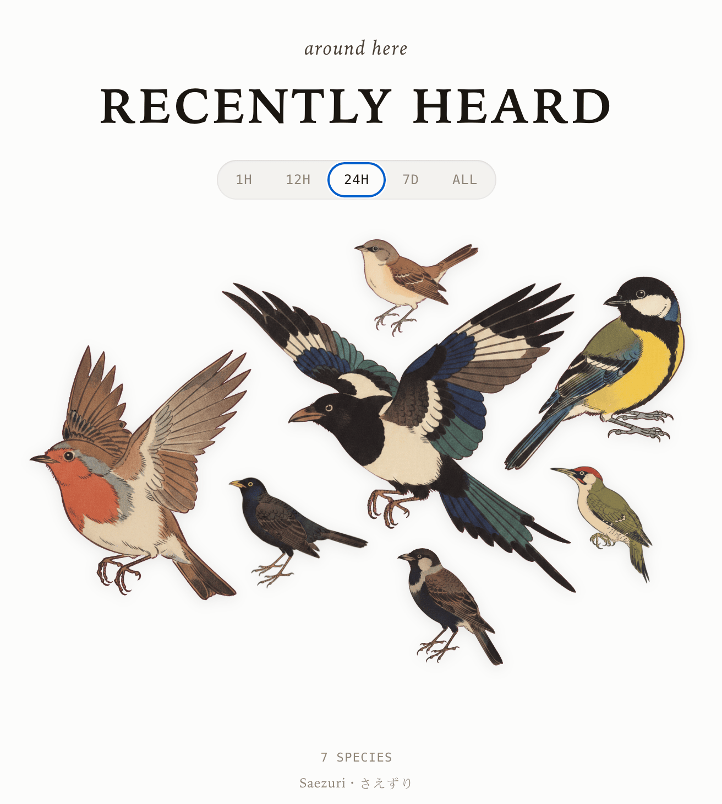
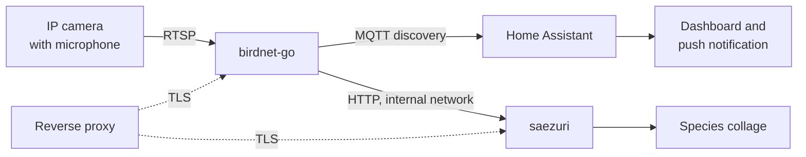
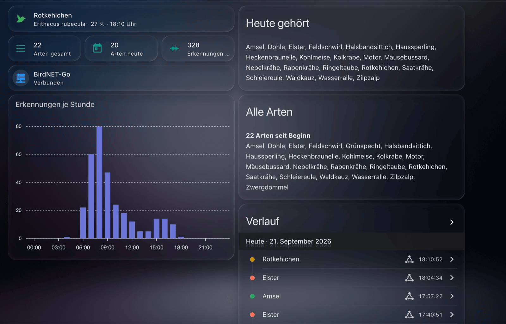
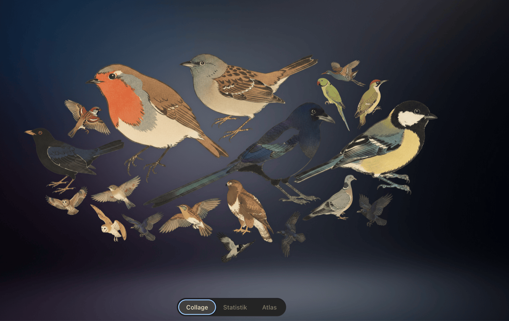

<p align="center">
  
</p>

<p align="center"><em>Saezuri, showing what the garden microphone heard in the last 24 hours.</em></p>

# Birding with AI

**Detect birds by sound with a security camera you already own.** No microphone, no Raspberry Pi, no extra
hardware. [BirdNET-Go](https://github.com/tphakala/birdnet-go) reads the camera's audio over RTSP,
identifies the species, and publishes every detection to [Home Assistant](https://www.home-assistant.io/)
over MQTT. [Saezuri](https://github.com/vrwrts/saezuri) renders the same detections as an illustrated
collage. Everything runs self-hosted in two Docker containers, on your hardware, without a cloud account:
the audio never leaves the machine and the recognition runs locally.

This repository holds a vendor-neutral runbook and the configuration snippets behind it. It comes from one
working installation and states which parts are verified and which are choices you may want to revisit.



## At a glance

| | |
|---|---|
| Input | Any RTSP stream carrying audio, from a camera you already own |
| Detector | BirdNET-Go with the BirdNET v2.4 model, around 6,500 species |
| Transport | MQTT with Home Assistant auto-discovery |
| Presentation | Home Assistant dashboard with the Bird Card collage, plus the Saezuri web interface |
| Extra hardware | None |
| CPU load | Around 34 % of an AMD Athlon 3000G per audio stream |
| Runs on | Docker Compose, x86 or ARM, a Raspberry Pi included |
| Data flow | Local. Audio and recognition stay on your machine, no account, no upload |
| Setup time | About 60 minutes including verification |
| Cost | Free, except optional artwork generation at roughly 0.04 US dollars per image |
| License | MIT |

## What you get

- Species detections from a camera microphone, no extra hardware.
- Four Home Assistant sensors that survive restarts: last species, species total, species today,
  detections today.
- A push notification on every species new to the garden.
- A Home Assistant dashboard with counters, an hourly chart, species lists, and the collage as a native
  card in a panel view.
- An illustrated collage, twice over: the [Bird Card](https://github.com/adamoberley/HABirdDashboard) draws
  it inside Home Assistant, and Saezuri serves its own page for the same species.

## What it looks like

The Home Assistant dashboard: the last species with its confidence, three counters, detections per hour,
the species heard today and since the start, and the logbook.



The same detections as a collage, drawn by the Bird Card in a panel view. Every bird in the picture was
heard, and the loudest talkers are drawn largest.



## Requirements

| Component | Requirement |
|---|---|
| Camera | RTSP stream carrying audio; a wide-band track (48 kHz Opus) beats a narrow-band one (16 kHz AAC) |
| Host | Docker with Compose v2; roughly one third of a modern x86 core per audio stream |
| Home Assistant | Optional; needs an MQTT broker and the MQTT integration |
| HACS | Optional; for the ApexCharts, Mushroom and Bird Card frontend cards |
| Reverse proxy | Optional; the runbook uses Caddy with an internal CA |
| Gemini API key | Optional; only for generating artwork Saezuri cannot download |

## Quick start

```bash
git clone https://github.com/mrebbert/Birding-with-AI.git
cd Birding-with-AI
cp snippets/.env.example .env
$EDITOR .env                              # camera, hostnames, coordinates
./snippets/scripts/check-rtsp-stream.sh   # does the stream carry audio?
./snippets/scripts/apply-placeholders.sh  # writes build/ with your values
```

`build/` then holds the Compose file, the Caddyfile, and the Home Assistant YAML ready to copy to their
places.

Then follow [RUNBOOK.md](RUNBOOK.md) from step 0. It takes about 60 minutes including verification.

## Repository layout

| Path | Contents |
|---|---|
| [RUNBOOK.md](RUNBOOK.md) | The installation, step 0 to step 8, each step with a checkpoint |
| [docs/architecture.md](docs/architecture.md) | The decisions behind the setup and what each one costs |
| [docs/tuning.md](docs/tuning.md) | Raising detection quality and removing false positives |
| [docs/operations.md](docs/operations.md) | Updates, backup, scaling, rollback |
| [docs/troubleshooting.md](docs/troubleshooting.md) | Every trap this installation hit, with the fix |
| [snippets/](snippets/) | Compose file, Caddyfile, Home Assistant YAML, all carrying placeholders |
| [snippets/scripts/](snippets/scripts/) | Four helper scripts, all reading the same `.env` |
| [img/](img/) | Screenshots, one folder per component |
| [CITATION.cff](CITATION.cff) | Machine-readable metadata for citing this work |

## Placeholders

Every snippet uses the same placeholder names. Replace them once and the files fit together.

| Placeholder | Meaning | Example |
|---|---|---|
| `CAMERA_HOST` | Address serving the RTSP stream, often the NVR rather than the camera | `192.168.1.10` |
| `RTSP_TOKEN` | Stream token, one per quality level | `Ab3xY9qZ` |
| `BIRDNET_HOSTNAME` | Public name of the BirdNET-Go interface | `birdnet.example.lan` |
| `SAEZURI_HOSTNAME` | Public name of the collage | `birds.example.lan` |
| `HA_HOSTNAME` | Home Assistant address, for the frame-ancestors header | `home.example.lan` |
| `BIRDNET_PORT`, `SAEZURI_PORT` | Loopback ports the reverse proxy forwards to | `8081`, `8090` |
| `MQTT_HOST` | MQTT broker | `mqtt.example.lan` |
| `MQTT_USER`, `MQTT_PASSWORD` | Broker credentials | `birdnet` |
| `LATITUDE`, `LONGITUDE` | Site coordinates; they drive the range filter | `52.52`, `13.40` |
| `SOURCE_SLUG` | How BirdNET-Go names the audio source inside entity IDs | `backyard` |
| `NOTIFY_SERVICE` | Home Assistant notify service | `notify.mobile_app_pixel` |

`snippets/scripts/apply-placeholders.sh` substitutes all of them from your `.env` into `build/`, so the
originals stay reusable. The runbook then names the file in `build/` at each step; see
[Preparation](RUNBOOK.md#preparation-fill-in-your-values-once). Replacing the placeholders by hand works
just as well.

## Local by default

Every part that touches your audio runs on your own hardware. The camera stream reaches BirdNET-Go over
your network, the model does its inference on that machine, and the detections land in a SQLite database
next to it. No account, no API key and no upload are needed to detect a single bird, and the setup works
on a network with no route to the internet.

Four connections do leave the machine, all of them on the server side, none of them carrying your audio:

| Connection | Purpose | How to avoid it |
|---|---|---|
| jsDelivr CDN | Saezuri downloads ready-made artwork from the free `vrwrts/saezuri-illustrations` library | Set `ILLUSTRATIONS_REPO` to empty and supply your own images |
| jsDelivr CDN, from the browser | The Bird Card lazy-loads one PNG per species it shows | Copy the card's `avian/assets/` to `/config/www/habird-art/` and set `image_base: /local/habird-art/` |
| Wikimedia Commons | Saezuri fetches one freely licensed reference call per species and caches it | Leave the species cards without a call |
| Gemini API | Generates artwork for species the library lacks, at roughly 0.039 US dollars per image | Leave `GEMINI_API_KEY` unset; those species then show no tile |
| Container registry | `docker compose pull` fetches new images | Update on your own schedule |

Saezuri's own page adds nothing: the browser talks only to Saezuri's origin. The Bird Card runs inside
Home Assistant and queries BirdNET-Go on your network directly; its artwork is the one CDN call it makes,
and `image_base` removes that too.

BirdNET-Go can reach outwards for things this runbook leaves off: uploading detections to BirdWeather,
fetching weather data, and error telemetry, which requires explicit opt-in. Each one is a switch in its
settings, and each one stays off unless you turn it on.

## Privacy and law

Camera microphones pick up conversations, including those of people passing by. This setup keeps that in
mind:

- Audio export stays off, so clips are discarded and only detections persist.
- The BirdNET-Go privacy filter stays on; it drops segments containing human speech.
- German law (§ 201 StGB) protects the spoken word of non-public conversation. Check the equivalent rule
  where you live before you point a microphone at the street.

## Frequently asked questions

### Can I detect birds with a security camera I already own?

Yes, as long as the camera has a microphone and serves an RTSP stream. BirdNET-Go reads that stream
directly, so no microphone, no Raspberry Pi and no sound card join the setup. The reference installation
uses a UniFi Protect camera pointed at a garden.

### Does BirdNET-Go work with UniFi Protect?

Yes. Protect serves RTSP on port 7447 and RTSPS on port 7441, usually on the NVR address rather than the
address the management interface shows. Each quality level has its own token, and the token changes
whenever the RTSP stream is switched off and on again. See [step 0 of the runbook](RUNBOOK.md).

### Which audio track should BirdNET-Go use?

The wide-band one. UniFi Protect carries two tracks: AAC at 16 kHz mono, usable up to 8 kHz, and Opus at
48 kHz stereo, usable up to 24 kHz. BirdNET evaluates up to 15 kHz, so only the Opus track covers its full
range; ffmpeg selects it on its own. Cameras with a single 16 kHz track still work, they lose the calls
above 8 kHz.

### How much CPU does one audio stream need?

Around a third of a modern x86 core: 34 % of an AMD Athlon 3000G for one stream at the default overlap.
Load grows roughly linearly per additional camera, and raising the overlap for deep detection raises it
further, because the model then runs more often per second of audio.

### How do I get BirdNET-Go detections into Home Assistant?

Through MQTT. Enable Home Assistant discovery in the BirdNET-Go MQTT settings, and Home Assistant gains
`binary_sensor.birdnet_go_status` plus, per audio source, `…_last_species`, `…_scientific_name` and
`…_confidence`. The template sensors in
[`snippets/home-assistant/templates/birds.yaml`](snippets/home-assistant/templates/birds.yaml) turn those
into a species list, a daily count and a last-species sensor that survives restarts.

### Why do my Home Assistant bird sensors read "unknown" after a restart?

Trigger-based template sensors start without state. A `homeassistant: start` trigger refills them, which is
why the snippet in this repository carries one. The same file adds a `bird_reset` event that clears the
species lists.

### How do I remove a false positive?

Mark the detection as a false positive in BirdNET-Go, clear the Home Assistant species list through the
`bird_reset` event, then raise the range filter threshold from its default of 0.01. The range filter weighs
every species by region and season, so it catches future candidates of the same kind without per-species
work. Low, steady noise such as a heat pump is the usual cause. See [docs/tuning.md](docs/tuning.md).

### Do I need Home Assistant for this?

No. BirdNET-Go stores every detection in its own SQLite database and shows them in its web interface;
Home Assistant and Saezuri are additions. Skip steps 5, 6 and 8 of the runbook to run the detector alone.

### What does the artwork cost?

Nothing for species covered by the free `vrwrts/saezuri-illustrations` library. For species missing there,
Saezuri generates two images through the Gemini API at roughly 0.039 US dollars each, so about eight cents
per species, once. The key stays optional; without it, uncovered species simply show no tile.

### Does this send my audio to the cloud?

No. The camera stream reaches BirdNET-Go over your own network and the recognition runs on that machine;
no audio is uploaded anywhere. Detections stay in a local SQLite database. The only outbound connections
are artwork downloads, one reference call per species, optional artwork generation and image pulls, all
listed under [Local by default](#local-by-default).

### Can it run fully offline?

Yes, for detection. BirdNET-Go needs no internet connection to analyse audio, publish over MQTT or serve
its interface. Saezuri without internet shows species that already have artwork cached; set
`ILLUSTRATIONS_REPO` to empty and place your own images in the illustrations directory to keep it fully
local.

### Is it legal to record audio from a camera microphone?

Check the rule where you live before pointing a microphone at a street or a neighbour's garden. This setup
keeps audio export off, so clips are discarded and only detections persist, and it leaves the BirdNET-Go
privacy filter on, which drops segments containing human speech. German law protects the spoken word of
non-public conversation in § 201 StGB.

## Credits

- [tphakala/birdnet-go](https://github.com/tphakala/birdnet-go) for the detector and its web interface.
- [vrwrts/saezuri](https://github.com/vrwrts/saezuri) for the collage and the illustration library.
- [adamoberley/HABirdDashboard](https://github.com/adamoberley/HABirdDashboard) for the Bird Card, which
  brings the collage into the dashboard itself.
- [BirdNET](https://birdnet.cornell.edu/) by the K. Lisa Yang Center for Conservation Bioacoustics.

## License

MIT, see [LICENSE](LICENSE).
