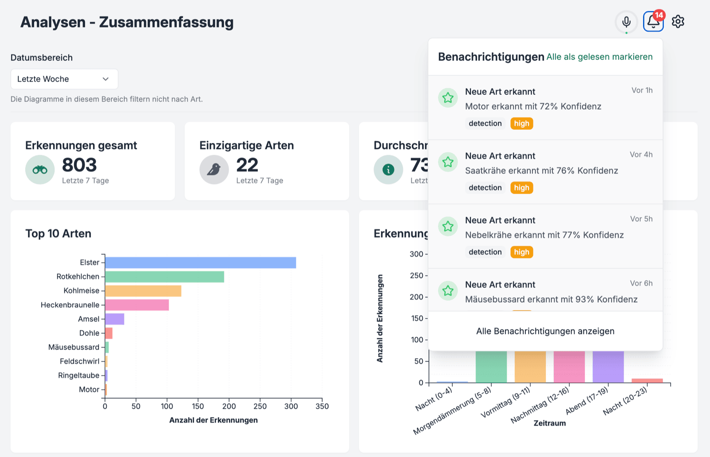
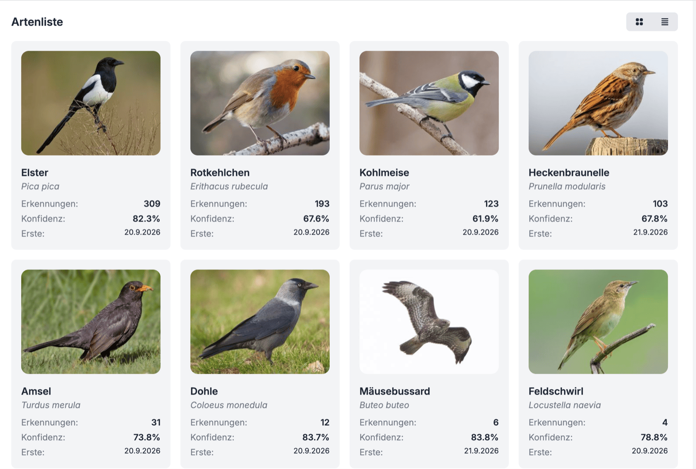
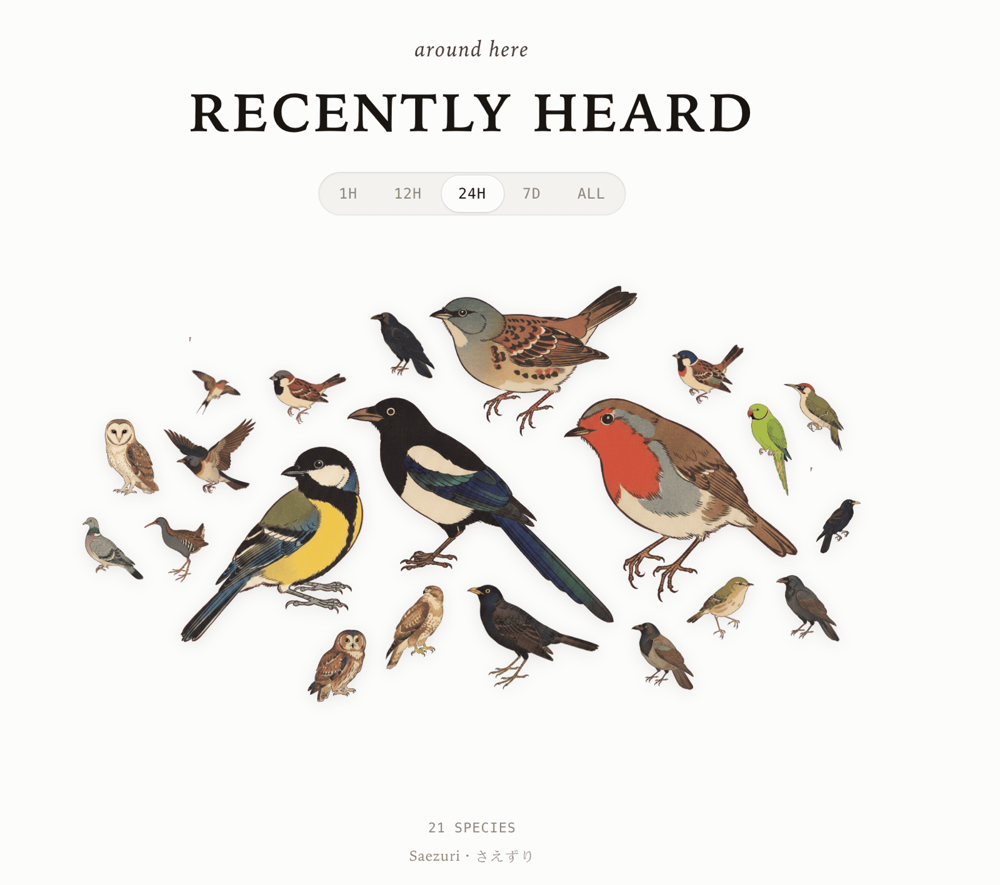
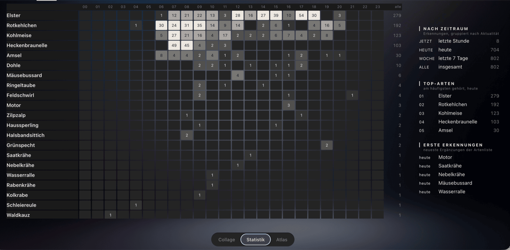
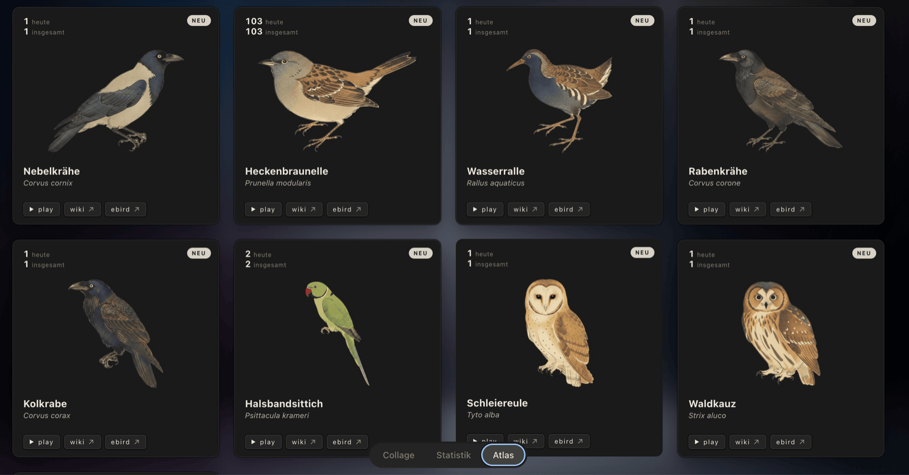
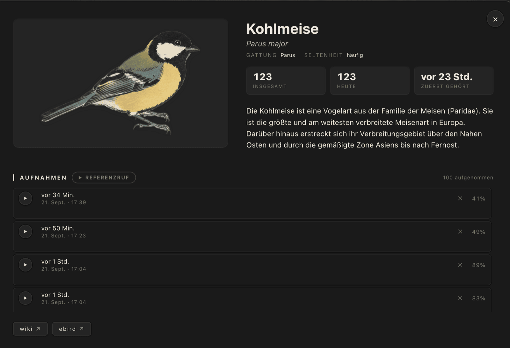

# Runbook: bird detection from an IP camera

Two containers, one existing camera. BirdNET-Go analyses the audio of an RTSP stream and delivers
detections to Home Assistant; Saezuri presents them as an illustrated collage.

**Target picture:** camera → RTSP → `birdnet-go` → MQTT → Home Assistant. In parallel `saezuri` reads the
detections over the Compose network. Both containers publish on `127.0.0.1` only; the reverse proxy is the
single entry point from the network.

**Scope:** everything that touches the audio runs locally, on your own hardware, with no account and no
upload. Audio clips are discarded on purpose, only detections persist. Camera microphones also capture
conversations on the pavement, so the BirdNET-Go privacy filter stays on. See
[README, Privacy and law](README.md#privacy-and-law).

**Duration:** about 60 minutes including verification.

**Reference deployment**, verified in continuous operation:

| | Value |
|---|---|
| Hardware | AMD Athlon 3000G, 16 GB RAM |
| Camera | UniFi Protect camera, one audio source |
| Host port BirdNET-Go | 8081 (container 8080) |
| Host port Saezuri | 8090 (container 8080) |
| CPU load | around 34 % of the machine for one stream |
| Result | detections every day, no restarts, no measurable system load |

---

## Preparation: fill in your values once

Every snippet in this repository carries literal placeholders (`CAMERA_HOST`, `BIRDNET_HOSTNAME`,
`SOURCE_SLUG`, …); the [README](README.md#placeholders) lists them all. Fill them in once and every file
below fits together:

```bash
cp snippets/.env.example .env
$EDITOR .env
./snippets/scripts/apply-placeholders.sh
```

This writes `build/` with your values substituted and leaves `snippets/` untouched as the source. From here
on the runbook names the file in `build/` and links the template it came from. `build/` and `.env` stay out
of git.

The `.env` ends up in two places: this one feeds the helper scripts, and step 2 copies it next to the
Compose file on the server, where Docker reads it. Scripts that work against the server take that path as
an argument.

Working without the script is fine too: copy the files from `snippets/` by hand and replace the
placeholders as you go.

Four helper scripts come along, all reading the same `.env`:

| Script | Purpose | Used in |
|---|---|---|
| `apply-placeholders.sh` | writes `build/` from `snippets/` and `.env` | here |
| `check-rtsp-stream.sh` | ten seconds of camera audio through ffmpeg | step 0 |
| `check-gemini-key.sh` | verifies the Gemini API key before a restart | step 7 |
| `reset-illustration-misses.sh` | unlocks species Saezuri gave up on | [troubleshooting](docs/troubleshooting.md#illustrations) |

---

## Step 0: verify the stream

The BirdNET-Go image ships ffmpeg, so test without installing anything:

```bash
./snippets/scripts/check-rtsp-stream.sh
```

The script runs this command with the values from your `.env`:

```bash
docker run --rm --entrypoint ffmpeg ghcr.io/tphakala/birdnet-go:latest \
  -hide_banner -rtsp_transport tcp -timeout 5000000 \
  -i rtsp://CAMERA_HOST:RTSP_PORT/RTSP_TOKEN \
  -vn -t 10 -f null -
```

**Checkpoint:** the output names an audio stream and ends after 10 seconds without an error. A line such as
`Stream #0:1: Audio: opus, 48000 Hz` is the one you want.

Notes that cost time to find out:

- **Take the wide-band track.** UniFi Protect carries two: AAC at 16 kHz mono (usable up to 8 kHz) and Opus
  at 48 kHz stereo (up to 24 kHz). BirdNET evaluates up to 15 kHz, so only the second one covers the range.
  ffmpeg picks it on its own.
- **The NVR serves the stream, not the management interface.** On a UniFi setup the RTSP port 7447 answers
  on the gateway address even when the Protect UI shows a different management address.
- **Tokens are per quality level** and Protect issues a new one whenever you switch the RTSP stream off and
  on again.
- **Port 7447 blocked?** `rtsps://CAMERA_HOST:7441/RTSP_TOKEN` works as well, without the `?enableSrtp`
  parameter. Plain RTSP inside a trusted network avoids TLS corner cases in ffmpeg.

## Step 1: set the camera microphone gain

Set the microphone sensitivity to 100 % in the camera settings. This is the only amplification ahead of the
compression and therefore the only control that truly improves the distance between a bird call and the
noise floor. Every gain stage behind the stream raises both alike.

Pull back to 80 or 90 % when the live spectrogram already saturates on ambient noise.

Switch off the camera's noise suppression where the vendor offers it: it is tuned for speech and damps high
frequencies, which is exactly where bird calls live.

## Step 2: directories and Compose blocks

```bash
ss -ltnp | grep -E ':(8081|8090) '     # BIRDNET_PORT and SAEZURI_PORT must be free
mkdir -p /srv/docker/birdnet-go/{config,data}
mkdir -p /srv/docker/saezuri/{illustrations,calls}
chown -R 1000:1000 /srv/docker/saezuri
id                                      # UID and GID for the Compose block
```

Copy the service definitions from `build/docker-compose.yml` into `/srv/docker/docker-compose.yml` and your
`.env` next to it. The file reads its values through `${VARIABLE}` substitution, which is why the
placeholder script passes it through unchanged. Template:
[`snippets/docker-compose.yml`](snippets/docker-compose.yml), variables:
[`snippets/.env.example`](snippets/.env.example).

Run the stack from `/srv/docker`, not from `build/`: the volume paths are relative to the Compose file, and
`apply-placeholders.sh` empties `build/` on every run.

Three points decide whether the stack comes up:

- **`chown` on the Saezuri directories is mandatory.** The container runs as 1000:1000 and otherwise aborts
  with `… is not writable by uid 1000:1000`. The `docker run … alpine chown` the log suggests applies to
  named volumes; with bind mounts a `chown` on the host is enough.
- **`BIRDNET_HOST`** sets the hostname BirdNET-Go uses for links in notifications behind a reverse proxy.
- **Saezuri reaches BirdNET-Go by container name on port 8080**, not over the loopback address. Both sit in
  the same Compose network.

## Step 3: reverse proxy

`build/caddy/Caddyfile` holds both virtual hosts with your hostnames already in place (template:
[`snippets/caddy/Caddyfile`](snippets/caddy/Caddyfile)). Caddy runs in the host network in this setup, hence
loopback addresses rather than container names. Validate the configuration and
reload afterwards:

```bash
caddy validate --config /etc/caddy/Caddyfile
systemctl reload caddy
```

## Step 4: configure BirdNET-Go

```bash
cd /srv/docker
docker compose up -d birdnet-go
docker compose logs -f birdnet-go
```

The container comes up with its defaults and serves the web interface at `https://BIRDNET_HOSTNAME`.
Everything else happens on the settings pages: you click through them once, in the order below, and the
system runs. Some versions greet the first call with an onboarding wizard that asks for location, locale,
audio source and a password; the values are the same either way, and the settings pages hold them all
afterwards.

Configure through the interface rather than by hand. The keys in `config.yaml` have changed names several
times between versions, and BirdNET-Go writes the file itself and picks changes up without a restart. Each
setting below names its key so you can verify what the interface wrote.

### Security, before anything else

Settings → Security: set a password for the interface. It carries a browser terminal with access to the
container, so this matters inside a private network too. Key: `security.basicauth.enabled` with
`security.basicauth.password`.

### Node and location

| Setting | Key | Value | Why |
|---|---|---|---|
| Node name | `main.name` | one name per host | Rides along in the MQTT topics and tells two machines apart |
| Latitude, longitude | `birdnet.latitude`, `birdnet.longitude` | `LATITUDE`, `LONGITUDE` | Feeds the range filter, which weighs every species by region and season. Town-level accuracy is enough |
| Language for species names | `birdnet.locale` | your locale | Decides the names in Home Assistant and in the collage |

### Audio source

Add the RTSP URL from step 0 with transport `tcp`; UDP loses packets on a busy network and leaves gaps in
the analysis. Several sources run in parallel, each with its own model and threshold.

Leave audio export off (`realtime.audio.export.enabled`). Detections persist in the database either way,
and clips of conversations stay off the disk. With export on, the retention policy
(`realtime.audio.export.retention.policy`) decides when clips go, by age or by disk usage.

**Checkpoint:** the interface reports 48000 Hz for the source, the level meter moves, and live listening
works.

### Detection and filters

These decide how well the system detects. Visit them once the first detections arrive, so you judge them
against your own data.

| Setting | Key | Start with | What it does |
|---|---|---|---|
| Model | model selection | BirdNET v2.4 | Around 6,500 species at about a third of a modern core per stream. Recent versions offer a gallery here, Google Perch v2 among them: more species, ONNX, and noticeably more CPU. See [docs/architecture.md](docs/architecture.md) |
| Confidence threshold | `birdnet.threshold` | 0.8 | Reports a detection from this confidence upwards |
| Overlap | `birdnet.overlap` | 1.5, raise to 2.7 for deep detection | Smaller steps between analysis windows, so the model runs more often per second of audio |
| Sensitivity | `birdnet.sensitivity` | 1.0 | Sigmoid sensitivity of the model. Leave it until threshold and overlap sit right |
| Range filter threshold | `birdnet.rangefilter.threshold` | 0.01 | Minimum occurrence probability a species needs to stay a candidate |
| Equalizer, high-pass at 150 Hz | `realtime.audio.equalizer` | on | Removes traffic rumble and wind; BirdNET evaluates from 150 Hz upwards anyway |
| Privacy filter | `realtime.privacyfilter.enabled` | on | Drops segments carrying human speech |
| Dog bark filter | `realtime.dogbarkfilter.enabled` | on where dogs live nearby | Suppresses the species a bark regularly triggers |
| Dynamic threshold | `realtime.dynamicthreshold.enabled` | on | Lowers the bar for a species for a while after a confident detection |
| Per-species threshold | `realtime.species.config` | empty | An override for the one species that keeps slipping through |

**Deep detection.** Raising the overlap makes BirdNET-Go require several hits inside a 15-second window
before it reports anything. The project computes the number as `max(1, 3 / max(0.1, 3.0 - overlap))`:

| Overlap | Detections required | Character |
|---|---|---|
| 0.0 | 1 | plain BirdNET behaviour |
| 2.4 | 5 | moderate |
| 2.7 | 10 | the usual deep detection setting, paired with threshold 0.5 |
| 2.9 | 30 | very strict |

The pairing the project recommends is `overlap: 2.7` with `threshold: 0.5`: the run of ten hits carries the
confidence that a single high threshold would otherwise have to carry alone, so more species arrive without
more noise. It costs CPU in proportion, because the model runs that much more often. Measure with
`docker stats birdnet-go` before and after, and see [docs/tuning.md](docs/tuning.md) for the order in which
to turn these controls.

**Range filter.** The threshold decides how unlikely a species may be and still count as a candidate. The
project gives these bands:

| Value | Effect |
|---|---|
| 0.01 | permissive, works for most locations, the default |
| 0.05 to 0.1 | only species with a higher occurrence probability |
| 0.1 to 0.3 | only species with a strong occurrence probability |
| 0.5 and above | only the most common species of your area |

Start at the default and raise it in steps when species appear that do not live near you. This is the
control that generalises; a per-species threshold fixes one name and leaves the next one open.

The full list of keys lives in the project's
[configuration reference](https://github.com/tphakala/birdnet-go/wiki/configuration-reference), the
background on both controls in the
[BirdNET-Go guide](https://github.com/tphakala/birdnet-go/wiki/BirdNET-Go-Guide).

### What the interface shows once it runs

The analytics summary counts detections and species over the chosen period and ranks the top ten. The bell
announces every species new to the station.



The species list carries every species heard, with its detection count, its mean confidence and the day it
first arrived. This is also where a false positive gets marked.



## Step 5: MQTT and Home Assistant

Check name resolution inside the container first. The image carries no network tools, so `getent` replaces
`ping`:

```bash
docker compose exec birdnet-go getent hosts MQTT_HOST
```

Then open Settings → Integrations → MQTT in the interface: broker `tcp://MQTT_HOST:MQTT_PORT`, user
`MQTT_USER`, topic `MQTT_TOPIC`, Home Assistant discovery enabled. These four values live in your `.env` as
documentation; BirdNET-Go stores them itself, so no file substitutes them.

```bash
docker compose logs --since 5m birdnet-go | grep -i mqtt
```

**Checkpoint:** `Successfully connected to MQTT broker` and `Home Assistant discovery messages published
successfully`. Home Assistant gains `binary_sensor.birdnet_go_status` plus, per source,
`sensor.birdnet_go_SOURCE_SLUG_last_species`, `…_scientific_name` and `…_confidence`.

> **`Connection … lost error=EOF` after pressing "Test" is harmless.** The test opens a second connection
> with the same client ID `BirdNET-Go`, so the broker drops the older one. BirdNET-Go reconnects within a
> second and republishes discovery.

## Step 6: species list and notification in Home Assistant

Copy `build/home-assistant/templates/birds.yaml` into your Home Assistant `templates/` directory and
`build/home-assistant/automations/bird_new_species.yaml` into `automations/`. Both carry your `SOURCE_SLUG`
and your notify service already; the templates are
[`snippets/home-assistant/templates/birds.yaml`](snippets/home-assistant/templates/birds.yaml) and
[`snippets/home-assistant/automations/bird_new_species.yaml`](snippets/home-assistant/automations/bird_new_species.yaml).
Both files come in list form, which is what `!include_dir_merge_list` in `configuration.yaml` expects.

All four sensors share one trigger block so the same event advances them together. Four design decisions
carry the file:

- **A sensor of your own for the last species.** The raw BirdNET-Go entity falls back to empty states
  between two detections, which show up in the logbook as "Unknown" and "Unavailable". The own sensor holds
  the last valid species together with confidence and timestamp.
- **A start trigger.** Trigger-based template sensors start without state. Without `homeassistant: start`
  the counters read `unknown` after every restart, and cards and charts stay empty.
- **The `bird_reset` event.** Clears both species lists from Developer tools → Events. This is how a false
  positive leaves the list again.
- **`detected_at` as its own attribute.** `relative_time` returns English text; a timestamp lets the
  dashboard format it freely.

> **Check the confidence scale.** If Developer tools show 82 rather than 0.82, the threshold in the template
> file becomes 75 and the factor 100 in the dashboard goes away.

**Checkpoint:** after a reload, `sensor.last_bird_species` carries a species name, and
`sensor.bird_species_total` counts up with the next new species.

## Step 7: start Saezuri

```bash
cd /srv/docker
docker compose up -d saezuri
docker compose logs -f saezuri
```

**Checkpoint:** `https://SAEZURI_HOSTNAME` shows the collage with species names in your locale; a click
opens the card with a reference call.



A `401` in the log means an API token is missing: create one in BirdNET-Go and add it as `BIRDNETGO_TOKEN`
to the Compose block. It stays server-side and never reaches the browser.

### Illustrations: library and generation

Saezuri shows a species once artwork exists: two images per species, perched and in flight. Without them the
tile stays absent even though the detection arrived. Saezuri first downloads from the library
`vrwrts/saezuri-illustrations` (free, no account); for species missing there it generates artwork in the
same style through the Gemini API, provided a key is configured.

Keep the key in the `.env` next to your Compose file, the one Docker reads, and reference it from the
Compose block:

```bash
echo 'GEMINI_API_KEY=AIza…' >> /srv/docker/.env
chmod 600 /srv/docker/.env
```

```yaml
    environment:
      BIRDNETGO_URL: http://birdnet-go:8080
      SPECIES_DICT_LOCALES: de,en
      GEMINI_API_KEY: ${GEMINI_API_KEY}
```

Then run `docker compose up -d saezuri`; a plain `restart` reads the `.env` again only on recreation.

**Cost:** Google bills the image models without a free tier, at roughly 0.039 US dollars per image. That
makes about eight cents per new species, once. Generation is capped at four images per pass with six seconds
between them.

Two traps wait here, both covered in [docs/troubleshooting.md](docs/troubleshooting.md): the AI Studio also
hands out an OAuth token that the API rejects with `400`, and failed attempts lock a species in
`_art-state.json` until you clear the markers. Verify the key before restarting:

```bash
./snippets/scripts/check-gemini-key.sh /srv/docker/.env
```

Watch progress straight on the directory; `docker compose logs … | grep -i saezuri-generate` names the
source per image (`repo` or `generated`):

```bash
watch -n 30 'ls -1 /srv/docker/saezuri/illustrations'
```

Your own artwork works too: place `<genus>-<species>.png` and `<genus>-<species>-2.png` in the same
directory, owned by 1000:1000.

## Step 8: the Home Assistant dashboard

Create a dashboard under Settings → Dashboards → Add dashboard, then paste
`build/home-assistant/dashboards/birds.yaml` into the raw configuration editor (template:
[`snippets/home-assistant/dashboards/birds.yaml`](snippets/home-assistant/dashboards/birds.yaml)). It needs
the four sensors from step 6 and three HACS cards: ApexCharts, Mushroom, and the Bird Card.

ApexCharts and Mushroom come from the HACS default list. The Bird Card is a custom repository: in HACS open
the three-dot menu → Custom repositories, add `https://github.com/adamoberley/HABirdDashboard` with type
**Dashboard**, then search for **Bird Card** and download it.

Three details proved necessary in operation:

- **`fill: zero` in the chart.** `func: diff` returns no value for hours without a data point; without this
  line ApexCharts draws `null` instead of a zero.
- **The logbook points at `sensor.last_bird_species`.** The raw entity would record every empty state as
  "Unknown" and "Unavailable".
- **`entity` on the counter cards.** A tap then opens the entity with its history.

The collage gets a view of its own with `panel: true` and uses the full width. The Bird Card draws it
natively inside Home Assistant, which keeps the theme, the tap actions and the light and dark modes
consistent with the rest of the dashboard.

Three values decide whether the card fills:

- **`birdnet_url` must be reachable from the browser.** BirdNET-Go publishes on loopback only, so this is
  the HTTPS name from step 3. Plain HTTP on an HTTPS dashboard is blocked as mixed content.
- **`data_source: auto`** queries that API first and falls back to the Home Assistant history of the MQTT
  sensors whenever the browser cannot reach it. The collage keeps working either way, with less depth on
  the fallback.
- **`ha_sensors`** pins the scientific-name sensor of your source. The card discovers several microphones
  on its own and sums them; the list is for choosing.

The card carries three views behind a switcher. Statistics counts detections per species and hour, and
names the top species and the newest arrivals.



The atlas lays out one card per species, each with its count for today and in total.



A tap opens the species, with its description, the counts, and every recording your own station caught.



Artwork lazy-loads per species from a CDN, one PNG each, cached by the browser. For an install with no
route to the internet, copy the card's `avian/assets/` to `/config/www/habird-art/` and set
`image_base: /local/habird-art/`.

> **Prefer an iframe?** Saezuri keeps serving its own interface at `https://SAEZURI_HOSTNAME`, and a
> `type: iframe` card embeds it. The browser then needs permission for the embedding: add a header with
> `frame-ancestors` for your Home Assistant address to the Saezuri virtual host and reload the proxy. The
> Caddyfile snippet carries the line, commented out.

---

## Where to go next

| Question | Document |
|---|---|
| Why this architecture and what each choice costs | [docs/architecture.md](docs/architecture.md) |
| Fewer false positives, more real detections | [docs/tuning.md](docs/tuning.md) |
| Updates, backup, a second camera, rollback | [docs/operations.md](docs/operations.md) |
| Something went wrong | [docs/troubleshooting.md](docs/troubleshooting.md) |
